Lab: Deploying F5 Distributed Cloud Bot Defense
===============================================

This lab will focus on the deployment and security of F5 Distributed Cloud Bot Defense via a BIG-IP 
Bot Defense Connector.  Deployment steps will be within the F5 Distributed Cloud Console and TMUI on
the BIG-IP.

**Task 1: Define the protected application in F5 Distributed Cloud Bot Defense**
~~~~~~~~~~~~~~~~~~~~~~~~~~~~~~~~~~~~~~~~~~~~~~~~~~~~~~~~~~~~~~~~~~~~~~~~~~~~~~~~

1. Login to the F5 Distributed Cloud tenant at
   `https://f5-xc-lab-sec.console.ves.volterra.io <https://f5-xc-lab-sec.console.ves.volterra.io/>`__.

   .. note:: 
      *The UDF deployment associated with this lab guide creates an ephemeral account and namespace for*
      *you in a F5 Distributed Cloud tenant. Shortly after launching this UDF deployment, you will receive*
      *an email requesting you to update/reset your password in this new ephemeral account. Please complete*
      *the password reset before continuing in this lab.*
   |lab001|

   .. note:: 
      *Example F5 Distributed Cloud ephemeral account Password Reset email.*

2. From the Home page select the Bot Defense tile.
   |lab002|

3. From the left-hand menu select **Manage >> Applications**. Then select the “\ **Add Protected Application**\ ” button.
   |lab003|

4. On the Protected Application screen do the following:

   a. Give the application a descriptive **Name** (like “f5bank”)

   b. Leave the **Application Region** as “US”.

   c. Select “Custom” for the **Connector Type**.

   d. Click **Save and Exit**.
      |lab004|

5. This will return you to the **Overview** screen.

From the left-hand menu select **Manage >> Applications** again. Click the ellipsis icon on the right of your newly defined
application. Here you will find the ability to copy various values that are needed to configure the BIGIP connector.
|lab005|

**Task 2: Configure BIGIP Distributed Cloud Bot Defense Profile**
~~~~~~~~~~~~~~~~~~~~~~~~~~~~~~~~~~~~~~~~~~~~~~~~~~~~~~~~~~~~~~~~~

1. Access the Web App in your UDF deployment.
   |lab006|

2. Take note of the FQDN. You will need this when configuring the Bot Defense profile on the BIGIP.
   |lab007|

3. Access the TMUI of your BIGIP 17.1. You can find the credentials to login in the Details page.
   |lab008|

4. In the F5 BIGIP TMUI, browse to **Distributed Cloud Services >> Bot Defense >> BD Profiles** and
   click the (+) icon to create a new Bot Defense profile.
   |lab009|

5. On the **New BD Profile…** screen edit the following settings:

   **General Properties**

   a. Give the BD profile a descriptive **Name**.

   **API Request Settings**

   b. Paste into the **Application ID** field the value copied from F5 Distributed Cloud console.

   c. Paste into the **Tenant ID** field the value copied from F5 Distributed Cloud console.

   d. Paste into the **API Key** field the value copied from F5 Distributed Cloud console.

      |lab010|

   **JS Insertion Configuration**

   e. Select the check box to enable **Inject JS in Specific URL**.

   f. In the **JS Inject Included Paths**, enter **/login/** and click  **Add**.

   **Protected Endpoint(s) – Web**

   g. For **Protected URIs**:

      i. In the **Host** field paste in the FQDN from the Web App Access Method for your BIGIP.

         .. note::
            *(See Exercise 2 step 2 above. The FQDN for your Web App will be similar to 3995dde2-4cf8-4c5b-89f2-2d0717d76d5b.access.udf.f5.com.)*

      ii.  Enter /**login/** into the **Path** field.

      iii. For now, leave the **Mitigation Action** set to **Continue**.

           .. note:: 
              *You will enable Blocking in a later step.*

      iv. Click **Add**.

      v.  Repeat steps i-iv above using **botdefense.udf.f5.com** in the **Host** field

   |A screenshot of a computer Description automatically generated with
   medium confidence|\ **NOTE:** *Ensure that both* **Hosts** *are
   listed in the* **Protected URIs** *section, as pictured above.*

  .. note:: 
     *The ephemeral hostname is needed to match requests that originate from outside the UDF environment.* 
     *The botdefense.access.udf.com hostname is needed to match requests that originate from inside the*
     *UDF environment (as the ephemeral hostnames are not accessible from inside UDF).*

   **Advanced Features**

   h. Select the **Advanced** view from the section dropdown.

   i. From the **Protection Pool – Web** dropdown select the **ibd-webus.fastcache.net** pool.

   j. From the **SSL Profile** dropdown select the **serverssl** profile.

   k. Choose **X-Forwarded-For** from the **Source of Client IP Address** dropdown.
      |lab012|

   l. Click **Finished**.

The F5 Distributed Cloud Bot Defense connector profile is now configured. However, in order to protect the application we must assign
the BD profile to the virtual server.

6. From the F5 BIGIP TMUI, browse to **Local Traffic >> Virtual Servers**. Select the **app-virtual** virtual server.
   |lab013|

   a. Select the **Distributed Cloud Services** tab at the top and then do the following:

   b. Set **Bot Defense** to **Enabled**.

   c. From the **Profile** dropdown, select the BD profile created in the previous step.

   d. Click **Update**.
     |lab014|

7. Clear all existing connections on the F5 BIGIP.

   a. Return to the UDF course tab in your browser and connect to the BIGIP using the Web Shell access method.

   b. Run the following command:

      **tmsh delete sys conn**

      .. note:: 
         *Clearing the connections is necessary to ensure that all requests to the virtual server are using the*
         *new configuration with the XC Bot Defense profile attached.*

**Task 3: Test Bots**
~~~~~~~~~~~~~~~~~~~~~~

1. Connect to the Bot server in your UDF deployment using the Web Shell access method:
   |lab015|

2. Change to the */home/ubuntu/bots* directory and list the contents:

   a. cd /home/ubuntu/bots

   b. ls
      |lab016|

   There are 3 types of Bots available for this Lab and a README file where you can find detailed information
   on how to make them work if you are interested in using them elsewhere.

3. Change to the **advanced** directory using the command  **cd advanced**

   In the **advanced** directory is a bot created using NodeJS and the Puppeteer browser automation tool.

   This Bot loads a Headless Chrome browser on stealth mode and attempts to log in using the credentials provided
   in the credentials/cred.txt file. Please open the credentials file and include the users you created during the
   1st step of this lab instructions.

4. Run the **advanced** Bot by issuing the following command: *node bot_multiple.js*
   |lab017|

   .. note:: 
      *If the Bot succeeds in sending the requests, you should get a similar output as the one above.*

5. In the **medium** directory will you find a Bot created using Python and Selenium browser automation tool.

   This Bot loads a Headless Chrome browser and attempts to log in using the credentials provided in the usernames.txt
   and passwords.txt files. Please open these files and include the users you created during the 1st step of this lab
   instructions.

6. Run the **medium** Bot by following the instructions below:

   a. Change to the medium directory.

   b. Run the command: source .venv/bin/activate

      .. note:: 
         *(This will activate the python Virtual Environment)*

   c. Run the command: python bot_medium.py
      |lab018|

      .. note:: 
         *If the Bot succeeds in sending the requests, you should get a similar output as the one above.*

7. In the **simple** directory will you find Bots created using *curl* and *python*.

   These Bots were created to replicate an automation tool that does not use a Web browser to send the
   requests and they should be detected by F5 Bot Defense as Token Missing request.

8. In order to run the **simple** Bots, please follow the instructions below:

   a. Change to the simple directory.

   b. Run the command: deactivate

      .. note:: 
         *(this will deactivate the previous python Virtual Environment)*

   c. Run the command: source .venv/bin/activate

      .. note:: 
         *(this will activate the current python Virtual Environment)*

   d. Run the command: ./curl_shape_token_missing.sh 10 botdefense.udf.f5.com. You should get the following output:

      |lab019|

   e. Run the command: python py_token_missing.py. You should get the following output:

      |lab020|

9. **OPTIONAL:** Return to the BIGIP TMUI and change the configuration for the two Protected URIs to
    enable Blocking. Then re-run steps 3 through 8 above.

**Task 4 – Review F5 Distributed Cloud Bot Defense Dashboard**

1. Return to the F5 Distributed Cloud Console. You may be required to re-authenticate if you have not been on this page for a while.

   If you have already closed this browser tab you can login at `https://f5-xc-lab-sec.console.ves.volterra.io <https://f5-xc-lab-sec.console.ves.volterra.io/>`__
   and select the Bot Defense tile.

2. From the right-hand menu, select **Overview > Monitor** and change the time range to **Last 1 hour**.
   Review the information on the **Monitor** dashboard.

   .. note:: 
      *If it has been more than 1 hour since you started this lab you can select a longer time range.*

   |lab021|

3. From the right-hand menu, select **Report > Traffic Analyzer**.
   |lab022|

   .. note:: 
      *On this page you can review details about individual requests.*

4. Add a filter to filter out the requests for the client JS.

   a. Select Add Filter
      |lab023|

   b. Choose **Traffic Type**

   c. Choose **Not In**

   d. Select **Others**

   e. Click **Apply**
      |lab024|

5. From the right-hand menu, select **Report > Bad Bot Report**.
   |lab025|

Review the information available on this page. Be sure to scroll down to see all graphs and data available.
|lab011|

+---------------------------------------------------------------------------------------------------------------+
| **End of Lab:**  This concludes the Lab.                                                                      |
+---------------------------------------------------------------------------------------------------------------+
| |labend|                                                                                                      |
+---------------------------------------------------------------------------------------------------------------+

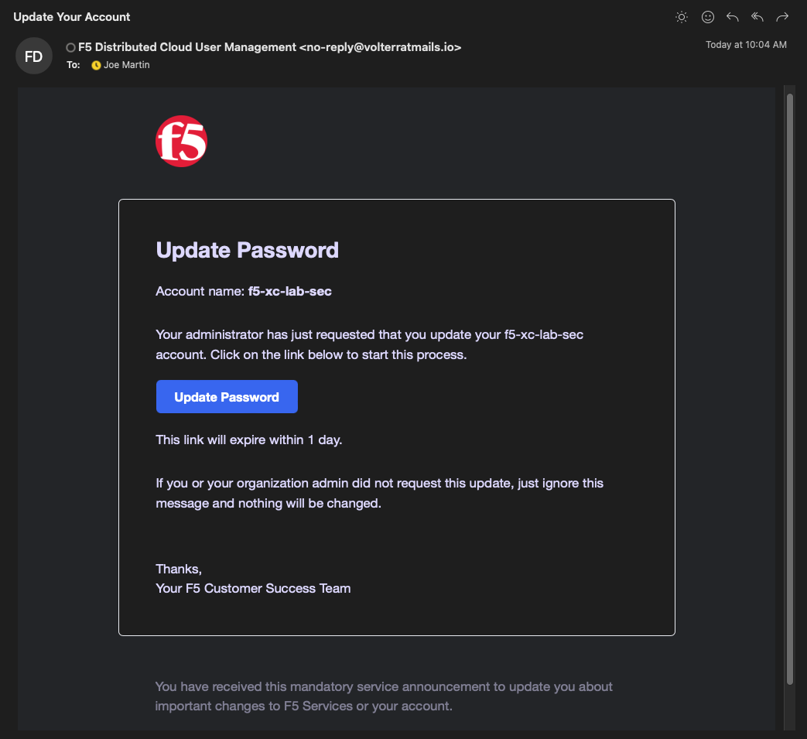

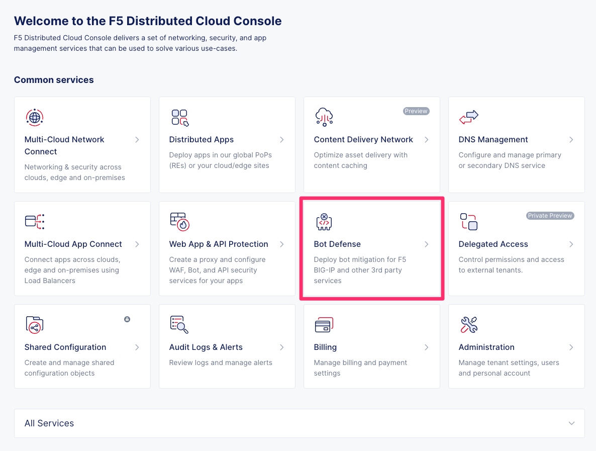

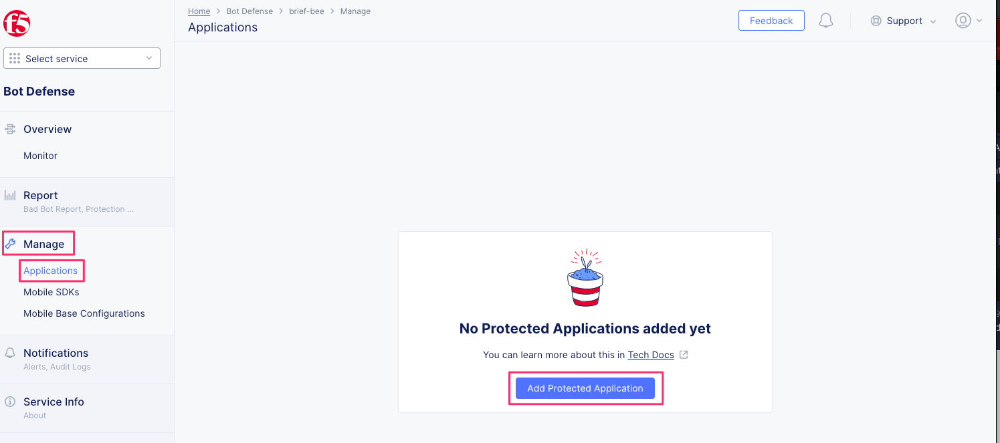

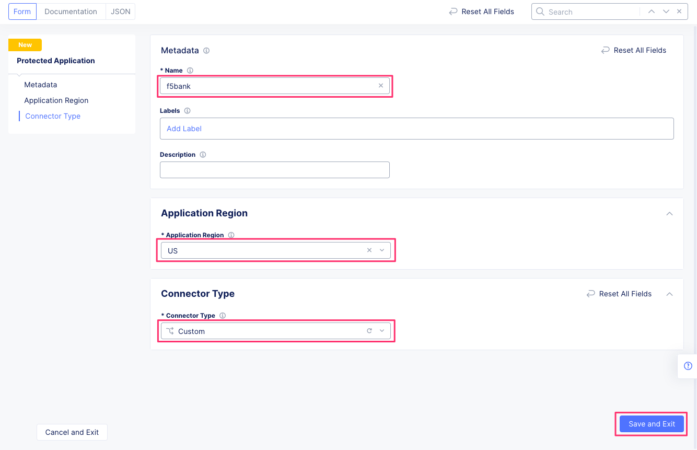

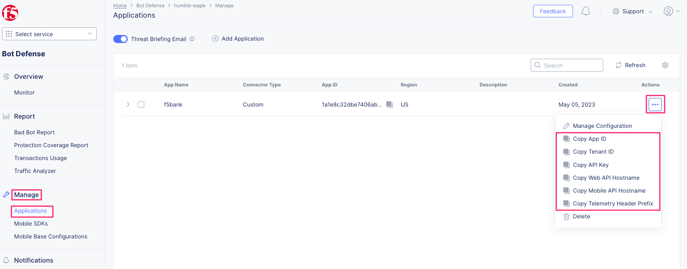

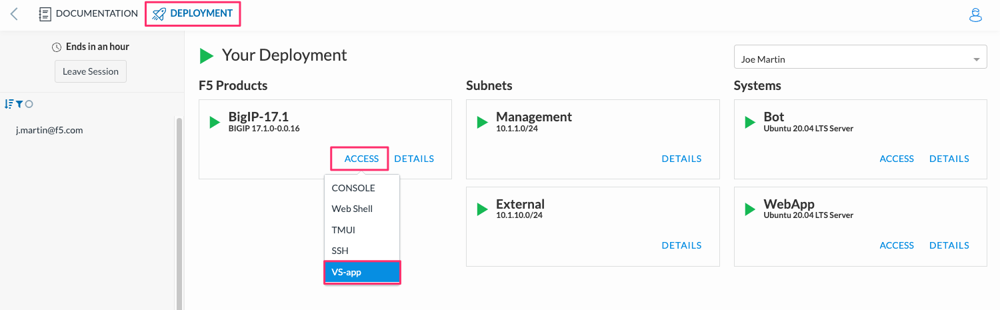

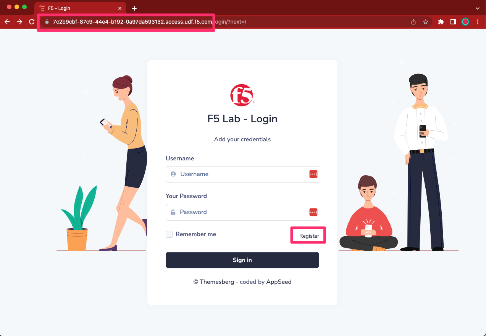

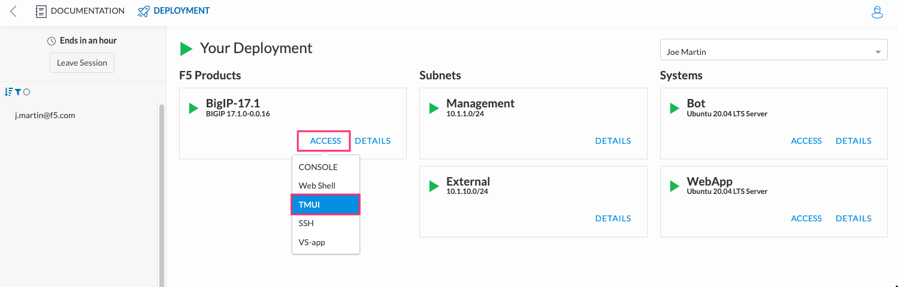

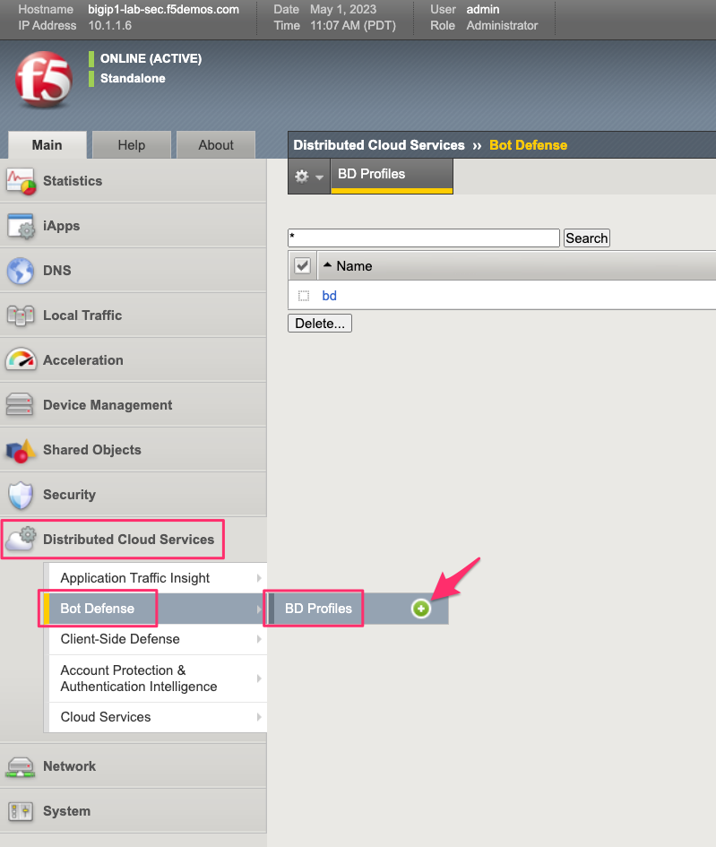

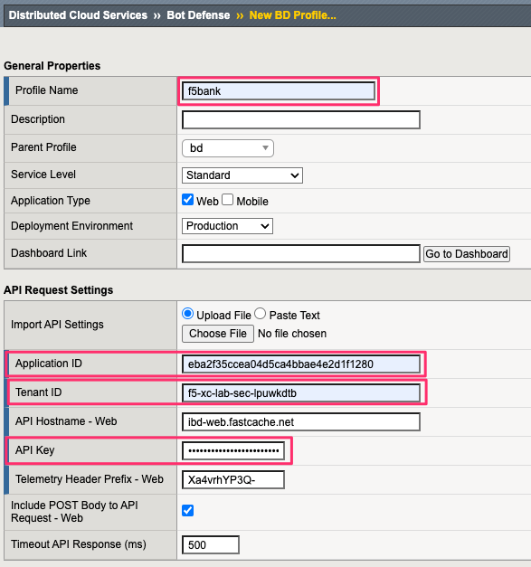

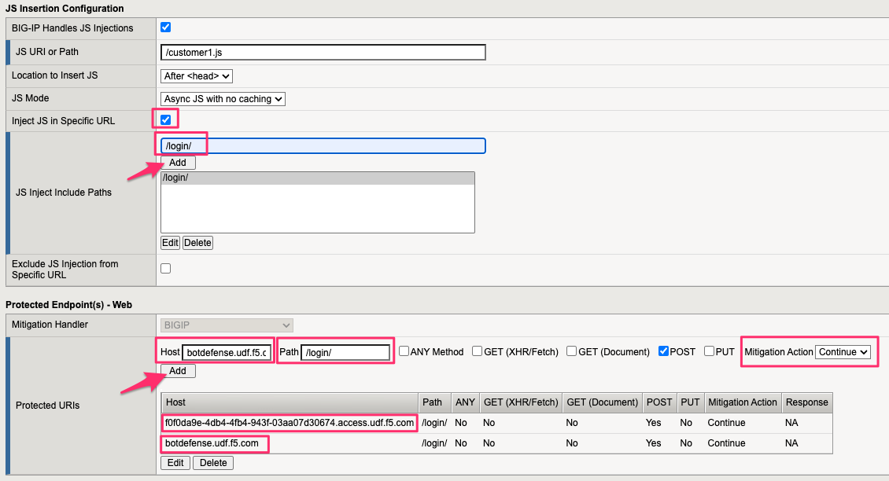

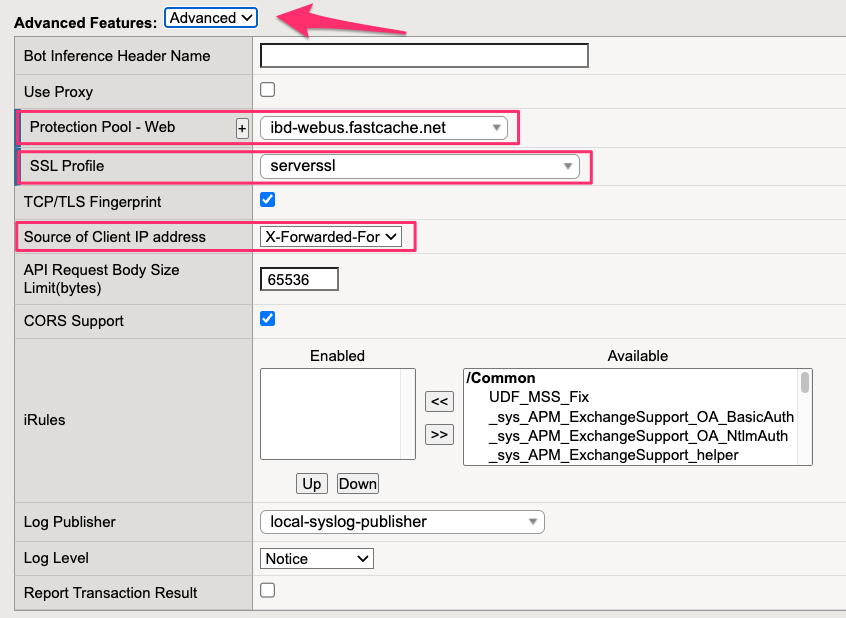

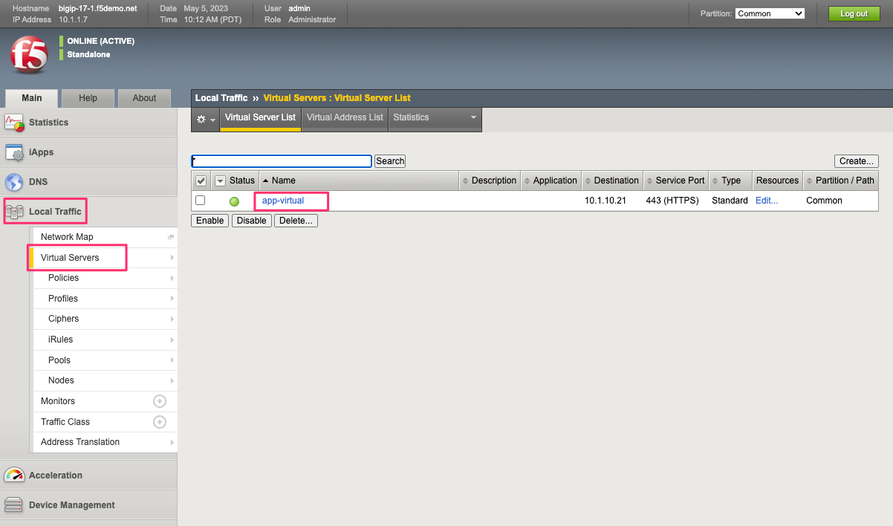

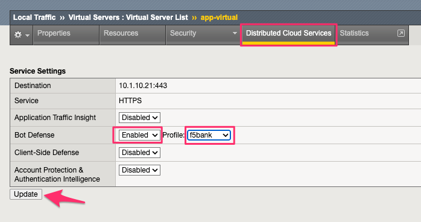

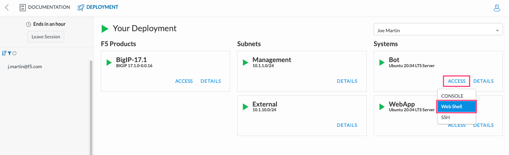

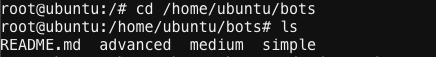

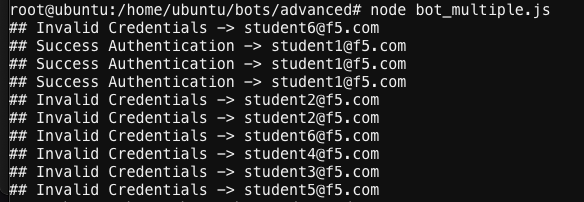

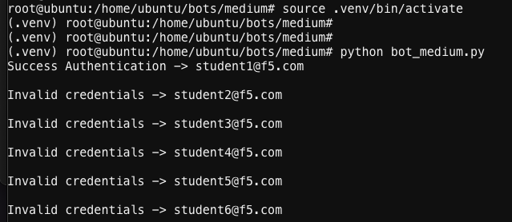

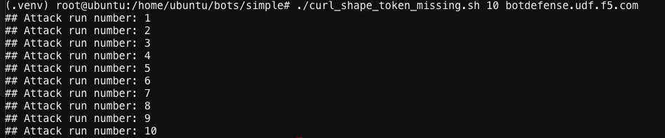

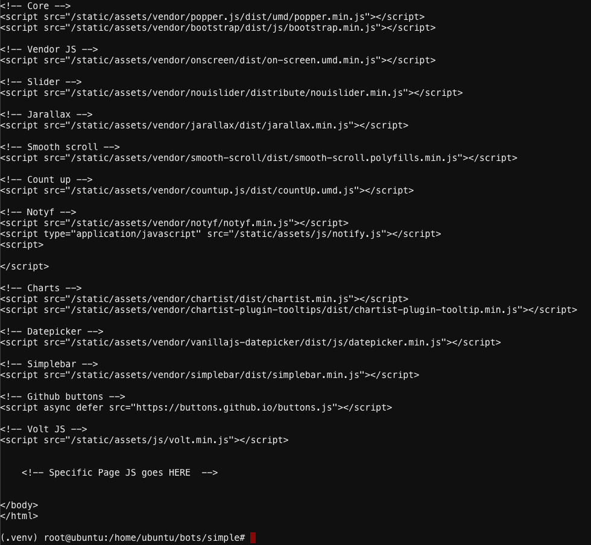

.. |labend| image:: _static//labend.png
   :width: 800px
